<picture>
  <source media="(prefers-color-scheme: dark)" srcset="dark.svg">
  <source media="(prefers-color-scheme: light)" srcset="light.svg">
  
</picture>

---

### I am an **AI & Automation Integrator** specializing in designing custom autonomous workflows, integrating LLMs, and building interactive Telegram-based applications. I bridge the gap between process logic and robust backend/frontend execution, optimizing operations for digital professionals, content teams, and micro- and small-businesses.

<picture>
  <source media="(prefers-color-scheme: dark)" srcset="./principles-dark.svg">
  <source media="(prefers-color-scheme: light)" srcset="./principles-light.svg">
  
</picture>

---

## 🧰 Tech Stack & Arsenal

#### Automation & Integration Core

#### Frontend & TMA Development

#### AI Infrastructure, Scripting & APIs

#### Infrastructure & Databases

---

## 🚀 Epic Projects & Quests

Selected autonomous logic & automation architecture case studies:

### 📱 Custom TMA Ecosystem & Control Panel
🔗 **TMA Management Framework** [React + Tailwind + Make + AI]: Architected and deployed a sophisticated mobile control panel inside Telegram, enabling users to monitor and manage complex backend automated pipelines with real-time KPI data visualization.

### 🤖 Autonomous LLM Processing & Media Pipelines
🔗 **Autonomous Media Agent Machine** [Make + OpenAI + Gemini + Claude]: Designed and orchestrated advanced, event-driven pipelines for multi-channel content re-authoring, semantic adaptation, and localized distribution across multiple platforms without human intervention.

### ⚙️ Automation Infrastructure & Deterministic Logic
🔗 **Deterministic Sales Qualifier** [Make + CRM + LLM]: Deconstructed unstructured customer intent logs into deterministic logical rules, using LLMs to profile, budget, and route qualified direct inquiries to CRM pipelines prior to human contact.
🔗 **PR Alert & Sentiment Monitor** [Make + LLM Semantic Parsing]: End-to-end webhook architecture tracking global brand mentions, processing incoming payloads with context-aware sentiment analysis, and instantly triggering critical alerts via Telegram for negative coverage.

*View the full project archive on [my Repositories](https://github.com/твой_ник?tab=repositories)!*

---

<picture>
  <source media="(prefers-color-scheme: dark)" srcset="./mission-dark.svg">
  <source media="(prefers-color-scheme: light)" srcset="./mission-light.svg">
  
</picture>

---

### 📫 **How to reach me:** 

#### Feel free to open an issue or connect with me if you need to structure your workflow logic and deploy tailored automation solutions.

---

