<picture>
  <source media="(prefers-color-scheme: dark)" srcset="dark.svg">
  <source media="(prefers-color-scheme: light)" srcset="light.svg">
  
</picture>

## About Me

I bridge the gap between business operational logic and robust technical execution. My focus is engineering fault-tolerant workflows, scalable digital products, and custom Telegram Mini Apps (TMA).

### 🛠️ Tech Stack & Tools
* **Automation & Integration Core:** Make (Integromat), REST APIs, Webhooks, Advanced Error/Fault Handling
* **Frontend & Custom Interfaces:** React, TypeScript, Tailwind CSS, Telegram WebApps API
* **AI Infrastructure:** LLM Integrations (OpenAI, Anthropic APIs), Autonomous AI Agents

## 🛠️ Tech Stack & Arsenal

#### Automation & Integration Core

#### Frontend & TMA Development

#### AI Infrastructure & Logic

### 📐 Core Principles
* **Fault Tolerance First:** Implementing strict error handling and data-flow validation to ensure stable process performance.
* **Logic Before Execution:** Thorough workflow auditing and precise requirements management before building.

## 📊 GitHub Stats & Grind

<table border="0" cellpadding="0" cellspacing="0" width="100%">
  <tr>
    <td width="50%" align="center" style="border: none;">
      
    </td>
    <td width="50%" align="center" style="border: none;">
      
    </td>
  </tr>
</table>

<!--
### 🌐 Find me online
[CodePen](https://codepen.io/anzhelikaspekter)
[Website](https://spekter.solutions)  
[Medium](https://medium.com/@anzhelikaspekter)  
[Telegram](https://t.me/anzhelikaspekter)  
[Patreon](https://patreon.com/anzhelikaspekter)
[Instagram](https://instagram.com/anzhelikaspekter)  
[Pinterest](https://pinterest.com/anzhelikaspekter)  
-->

### 📊 GitHub Metrics

---

### 📬 Connect with me
* [LinkedIn](https://www.linkedin.com/in/anzhelikaspekter/)
* [Telegram Channel](https://t.me/flowautomator)

